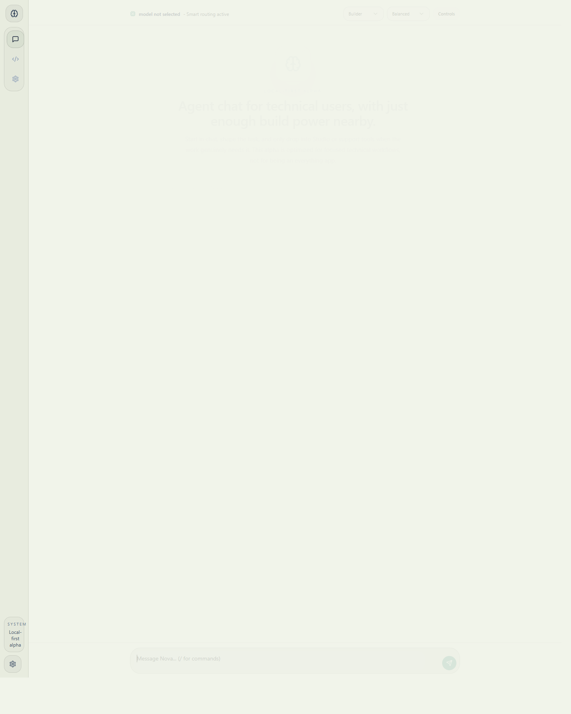
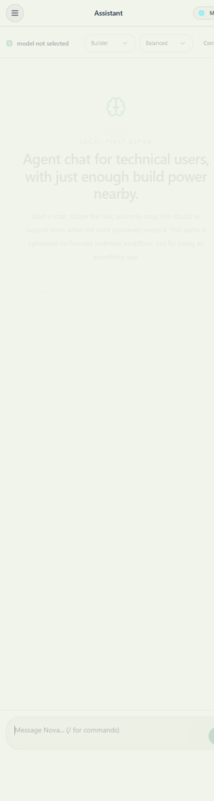

# Nova

Nova is a local-first agent chat workspace for technical users. The core idea is simple: start in chat, turn a fuzzy technical request into a clear plan, and only widen into files, previews, or commands when the work becomes concrete.



## What Nova is for

- Diagnosing bugs and narrowing likely failure points before touching code
- Planning implementation work before opening the IDE surface
- Editing real project files, previews, and commands in Studio when needed
- Accumulating reusable knowledge through memory, teach, and skills
- Keeping remote exposure guarded instead of making it the default story

## Product stance

Nova is being shipped as an open-source alpha for technical users.

- Chat is the primary workflow.
- Studio is the execution surface, not the headline.
- Teach, Skills, Doctor, and Ops are support surfaces around the main loop.
- Local-first posture matters more than maximizing surface area.

## Hero workflow

1. Start in chat and define the task.
2. Let Nova reason, summarize, or propose a first pass.
3. Move into Studio only when files, previews, or commands are required.
4. Use support surfaces when the task benefits from memory, diagnostics, or orchestration visibility.

## Quick start

1. Install dependencies

```bash
npm install
```

2. Create your environment file

```bash
cp .env.example .env
```

On Windows PowerShell:

```powershell
Copy-Item .env.example .env
```

3. Set required values in `.env`

```env
DATABASE_URL=file:./db/custom.db
TOKEN_ENCRYPTION_SECRET=replace-with-a-random-64-char-hex-string
```

Recommended for any non-local deployment:

```env
NOVA_API_SECRET=replace-with-a-long-random-string
NOVA_ALLOW_REMOTE_UI=false
```

Legacy `NTOX_*` env vars are still accepted for compatibility.

4. Initialize the database and run the dev server

```bash
npm run db:generate
npm run db:push
npm run dev
```

5. Open `http://localhost:3000`

## Security defaults

- Localhost requests work out of the box.
- Remote UI is blocked unless `NOVA_ALLOW_REMOTE_UI=true`.
- Remote API calls require `NOVA_API_SECRET`.
- Webhook routes keep their own service-specific auth.

## Screenshots

| Desktop | Mobile |
| --- | --- |
|  |  |

## Cross-platform scripts

- Standard dev: `npm run dev`
- Bootstrap: `npm run dev:bootstrap`
- Windows helper: `npm run dev:win`
- Unix helper: `npm run dev:unix`
- Windows build helper: `npm run build:win`
- Windows start helper: `npm run start:win`

## Scheduler

- Continuous mode: `npm run scheduler:run`
- One pass: `npm run scheduler:once`

Useful environment variables:

```env
NOVA_SCHEDULER_BASE_URL=http://localhost:3000
NOVA_SCHEDULER_INTERVAL_MS=60000
```

## Verification

```bash
npm run lint
npm run typecheck
npm run build
```

## Documentation

- [Onboarding](docs/ONBOARDING.md)
- [Deployment](docs/DEPLOYMENT.md)
- [Security](docs/SECURITY.md)
- [Performance](docs/PERFORMANCE.md)
- [Skills audit](docs/SKILLS.md)
- [Generated skill report](docs/SKILL_AUDIT_REPORT.md)

## Open-source alpha baseline

SQLite is fine for local and light workloads. For production, prefer PostgreSQL and set `DATABASE_URL` accordingly. See [docs/DEPLOYMENT.md](docs/DEPLOYMENT.md) for details.
